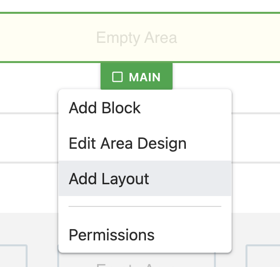
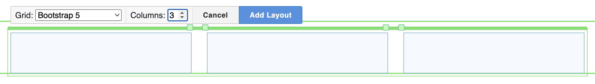

# Creating Page Layouts

There are two common ways of changing the broader layout of a page:

## Creating Area Layouts

Editable areas on a page can be split up in further columns of editable areas. To add a layout:

1.  Select the **Edit Page (Pencil)** button on the top toolbar.&#x20;

    <figure><figcaption></figcaption></figure>
2. Hover over the an editable area on the page - a small label will appear beneath it with the name of the area.
3. Click the area label and select _Add Layout_.
4.  The layout controls will appear. Adjust the number of columns needed and resize them by dragging the square handles to the sides of each column.

    <figure><figcaption></figcaption></figure>
5. Press the blue **Add Layout** button to finalise the layout.
6. Blocks can now be placed into the new layout areas.

**Note:** on some installs new layouts won't immediately appear. In this case simply refresh the page to see the new layouts - changes you have made will not be lost.

## To adjust an existing layout

While in edit mode, a layout can be adjusted by clicking on an area label and selecting **Edit Container Layout**. This will allow you to resize the existing columns. Layouts can also be removed by clicking the trash icon.

### Move your blocks before deleting layouts

When a layout is deleted from a page the blocks within it are also deleted. If you wish to keep the blocks within a layout, move them out of the layout to another area first.
