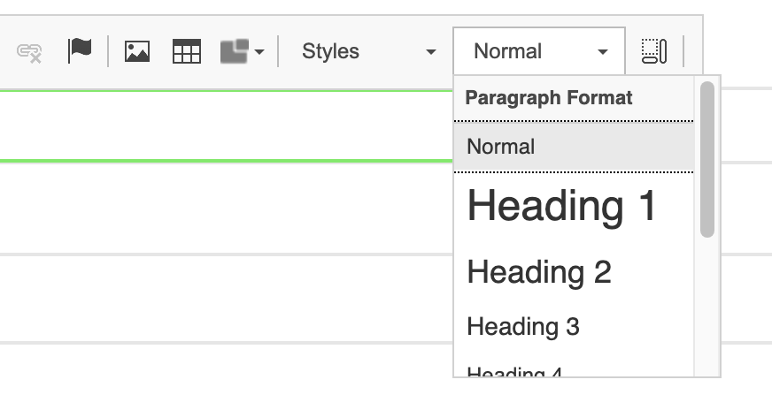
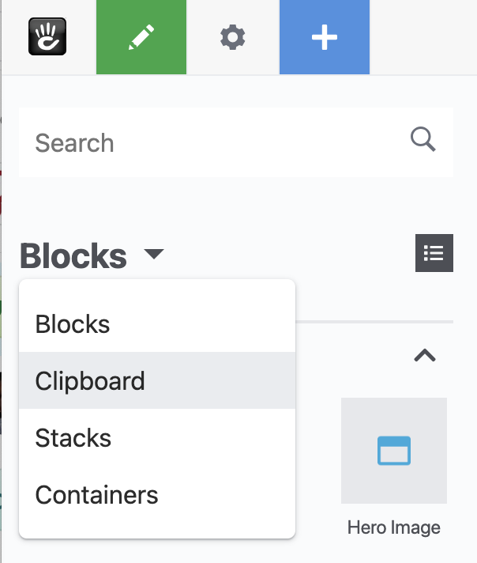

# Common Editing Tasks

## To insert headings and paragraphs

Use the Content block to include text headings and paragraphs on a page. Add or Edit a Content block, _highlight some text_ and select the **Formatting** drop down on the toolbar and select a heading type. 

## To insert links to pages, files and external URLs

Within a Content block, _highlight some text_ and select the **Link** button on the Content block toolbar.

From the dialog, you can either:

* Select the sitemap button, to select a page within your site. 
* Select the file button, to select a file to link to from the file manager.
* Directly enter the URL that you wish to link to \(in particular for external websites\).

## Adding Images

Images can be added in two ways:

* By adding an **Image** block.
* By using a **Content** block and placing an image directly within the content.

## Adding YouTube videos

Add a **YouTube Video** block to embed a youtube video. Paste in the address of the video from youtube \(e.g. [https://www.youtube.com/watch?v=ABCDEF](https://www.youtube.com/watch?v=ABCDEF)\) into the YouTube URL field and press 'Add'.

## To copy blocks to the clipboard

Blocks can be copied to a 'clipboard' within concrete5, allowing them to be easily copied between pages. To copy a block:

* Put the page into Edit Mode
* Click on the block you wish to copy and select 'Copy To Clipboard' from the popup menu

## To place blocks from the clipboard

1. Select the **Add Content \(Plus\)** button on the top toolbar. The block toolbar will slide in from the left.
2. At the top of the panel, click the dropdown and select **Clipboard** from the options.
3. Blocks within the clipboard will be displayed. Drag the block you wish to place into an editable area.

_**The block panel dropdown where the clipboard can be selected**_

